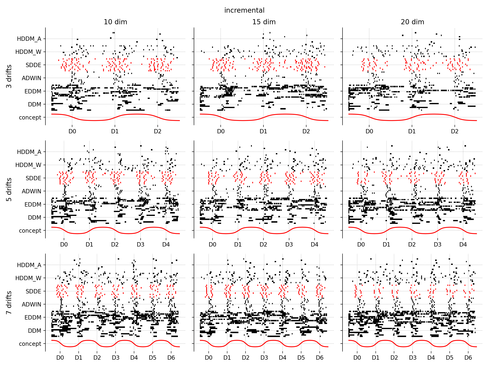

# statistical-drift-detection

x exp_1_plot_all
x exp_1_plot
x exp_2_sensitivity_plot
- pixel_plot_d_f
- pixel_plot  (tylko dla 5 dryfów i 15 cech)
- real_plot

| Data stream | #Samples | #Features | IR | n_chunks | samples_per_chunk |
| --- | --- | --- | --- | --- | --- |
| covtypeNorm-1-2vsAll | 266 000 | 54 | 4 | 265 | 1000 |
| poker-lsn-1-2vsAll | 360 000 | 10 | 10 | 359 | 1000 |
| INSECTS-abrupt_imbalanced_norm | 300 000 | 33 | 4 | 300 | 1000 |
| INSECTS-gradual_imbalanced_norm | 100 000 | 33 | 3 | 100 | 1000 |
| INSECTS-incremental_imbalanced_norm | 380 000 | 33 | 5 | 380 | 1000 |
| INSECTS-abrupt_imbalanced_norm_5prc | 300 000 | 33 | 19 | 300 | 1000 |
| INSECTS-gradual_imbalanced_norm_5prc | 100 000 | 33 | 19 | 100 | 1000 |
| INSECTS-incremental_imbalanced_norm_5prc | 380 000 | 33 | 19 | 380 | 1000 |
